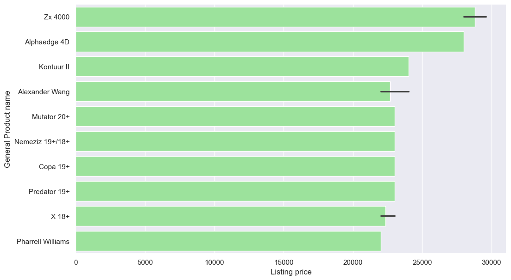

  <h1><strong>Nike vs Adidas</strong></h1>
  <h3><em>An In-Depth Exploration through Data Analysis and Web Scraping</em></h3>
  <h3><small>Cleaning, Exploring, Extracting, Transforming, and Visualizing data</small></h3>
  <h3><small>Project - 2</small></h3>

## *1. Introduction*
Two of the biggest names in sports, Nike and Adidas, have grown significantly over the past few decades as the industry has expanded. Even with the industry's diversification, both businesses are firmly established in similar markets that include sportswear, footwear, and equipment. Their rivalry has become greater because of their common interest.

### **Dataset**
For this research, two distincts datasets were employed: 

The first dataset, sourced from Kaggle,compared Adidas and Nike products.It includes information about products ID, products names, prices, discounts, ratings and reviews from both brands. 

The second dataset contains only and exclusively Nike products, generated through web scraping the official Nike webpage. It provides products ID, product names, prices and gender. It is important to mention that ratings and reviews are not included in this dataset, as it is nformation not available in the web-page. 

A combination of these datasets facilitates an in-depth analysis of pricing, discounts, and client feedback, hence augmenting a comprehensive comprehension of the competitive terrain among Adidas and Nike.

## *2. Methodology*
Kaggle's dataset:
1. Cleaning dataset: staying with just Adidas brand, as Nike products were almost empty
2. Exploring data (EDA)
3. Data visualization 

Nike's dataset: 
1. Web scraping: define functions, and apply teh to each column 
2. Cleaning the resulting dataset
3. Merge with Nike's Kaggle part dataset by product ID. 
4. Data visualization 

## *3. Pipeline*
1º Data Collection: Divided in two groups

Web Scraping: Identify the websites or platforms in which collect data.In this case Nike webpage. 
Specific data points to scrape: product name, product ID, price, shoe category, gender, colors. For this steps I used BeautifulSoup and requests libraries.

2º. Data Cleaning: Necessary to handle missing or inconsistent data, convert data types, for example from float to int. And remove duplicated data and non-important outliers.

3º Exploratory Data Analysis (EDA)

4º Data visualization: histograms, countplots, barplots and violinplots.

## *4. Aims*
The aim of this study is to study the footwear products that these brands sell. The study's objectives are to evaluate and compare a number of variables, such as costs, sales, categories, and other relevant elements. With this investigation, we hope to identify and assess Nike and Adidas' respective advantages in the fiercely competitive shoe industry.

## *5. Analysis*
During the data collection, different problems where encountered:  
- Nike has a dynamical webpage, so for this case a selenium webscrapping would have been very usefull to extract shoes information. But instead I went through all the different shoe models and performed a BeautifulSoup webscrape. 
- Nike do not have as mucha sales as Adidas do. For this reason, I couldn't compare the sales percentage.
- Nike webpage didn't include the shoe ranking make by customer, so it was impossible to make a top 5 shoes.
However I could compare between prices and shoes category. 

Also, there was a handicap during this work, and is the difference of amount of product between each brands. From the whole dataset, adidas is an 83.3%, and nike just a 17% of the dataset.

## *6. Results* 

Adidas shoe prices:

Nike shoe prices:

## *7. Conclusion*
We can not conclude which brand is better, as it would be very abstract 

## *8. Links*
[Canvas presentation](https://www.canva.com/design/DAFyzb5F0HQ/HWRenM9ZBpqAnCaT7Abuew/edit?utm_content=DAFyzb5F0HQ&utm_campaign=designshare&utm_medium=link2&utm_source=sharebutton)

[Nike official website](https://www.nike.com/es/w/zapatillas-y7ok)

[Adidas official website](https://www.adidas.es/zapatillas)

